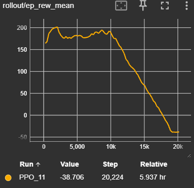

# RBE-Capstone

## Branch Summary
This branch deviates from the reinforcement learning (RL) pipeline architecture of the main branch by offering an alternative approach to dynamically tuning the robot's local path planner. More specifically, this branch used the Proximal Policy Optimization (PPO) algorithm to train an agent to configure the ROS2 DWB planner based on down-sampled lidar returns, errors between the goal pose and current pose components, and current velocity components. All dependencies to evaluate and train the agent in this branch are contained within an associated docker image (`ghcr.io/ecwenzlaff/rbe-capstone:0.0.2_ecw`) that's linked in all of the docker-compose files. If it's not already stored locally, the required docker image will automatically be pulled when using the provided docker-compose files. On Windows, this needs to be done by navigating to the `wsl_entrypoint` directory and running the `./run_image_wsl.sh`, because Windows requires exposing additional environment variables and volumes for everything to work (this requires [WSL2](https://learn.microsoft.com/en-us/windows/wsl/install) and [Docker Desktop](https://docs.docker.com/desktop/setup/install/windows-install/) to be installed as pre-requisites.)

## Evaluation Demo
Once inside a `ghcr.io/ecwenzlaff/rbe-capstone:0.0.2_ecw` container, a demo for the trained agent can be exectued immediately via:
```
ros2 run rl_pipeline demo.sh
```
The `demo.sh` script is essentially just a wrapper for calling the evaluation launch file (`./rbe_capstone/rl_pipeline/launch/eval.launch.py`) that automatically brings up the evaluation results in gvim when the evaluation process is complete. As a result of this, more in-depth evaluation would involve calling the launch file directly via `ros2 launch` (see `eval.launch.py` file for additional input arguments). Even so, the `demo.sh` script *does* contain additional input arguments for the episode selection seed and number of evaluation episodes. For example, running:
```
ros2 run rl_pipeline demo.sh --seed 46 --num-episodes 1
```
Should display something like this:
<video autoplay muted playsinline src="https://github.com/user-attachments/assets/32a324d6-998d-4b12-8957-1c78a59cacb3" width="100%" controls> </video>

## Training
The scope of this project was incredibly ambitious given the time constraints (see reports in the `Report` directory of the main branch for more insight into development); so training iterations were cut short as soon as the results were "good enough" for proof of concept. This means that there's a lot of room left for improvements through hyperparameter tuning and re-training. If retraining is desired, all training is handled through the launch file, `./rbe_capstone/rl_pipeline/launch/train.launch.py`, which comes with it's own set of input arguments for a subset of hyperparameters. It's worth noting that the launch file's current default values reflect the training configuration that was used to generate the results included in the final project report. It's also worth noting that due to divergence late in the training process (see image below), the PPO checkpoint from 10000 steps (`./rbe_capstone/rl_pipeline/rl_checkpoints/ppo_nav2_dwb_10000_steps.zip`) was used to generate the final (best) results:
<p align="center">
  
</p>

## Further Development
As referenced earlier, there's a lot of room left for further improvements. In order to help make development easier, a number of capabilities have been added to the docker image; along with aliases for the image `~/.bashrc`:
- **`code <filepath>`** &mdash; opens a vscode-server instance (preloaded with the ROS2 library extension) at `<filepath>` (e.g. `code .` will open code-server in the present working directory).
- **`colconclean`** &mdash; jumps to the workspace directory and cleans all `colcon build` artifacts (e.g. `install/*`, `build/*`, and `log/*`), then jumps back (via `pushd` and `popd`).
- **`colconbuild <optional pkg name>`** &mdash; jumps to the workspace directory and performs a `colcon build <optional pkg name>`, then jumps back (via `pushd` and `popd`). If no `<optional pkg name>` was supplied, `colcon build` is performed on the entire workspace.
- **`init_env`** &mdash; sources the ROS distro, the image workspace, and the global python virtual environment for the image. Should always be run after calling `colconbuild` or anytime the Python virtual environment gets deactivated for some reason (may occur as a byproduct of exiting the `demo.sh` script).
