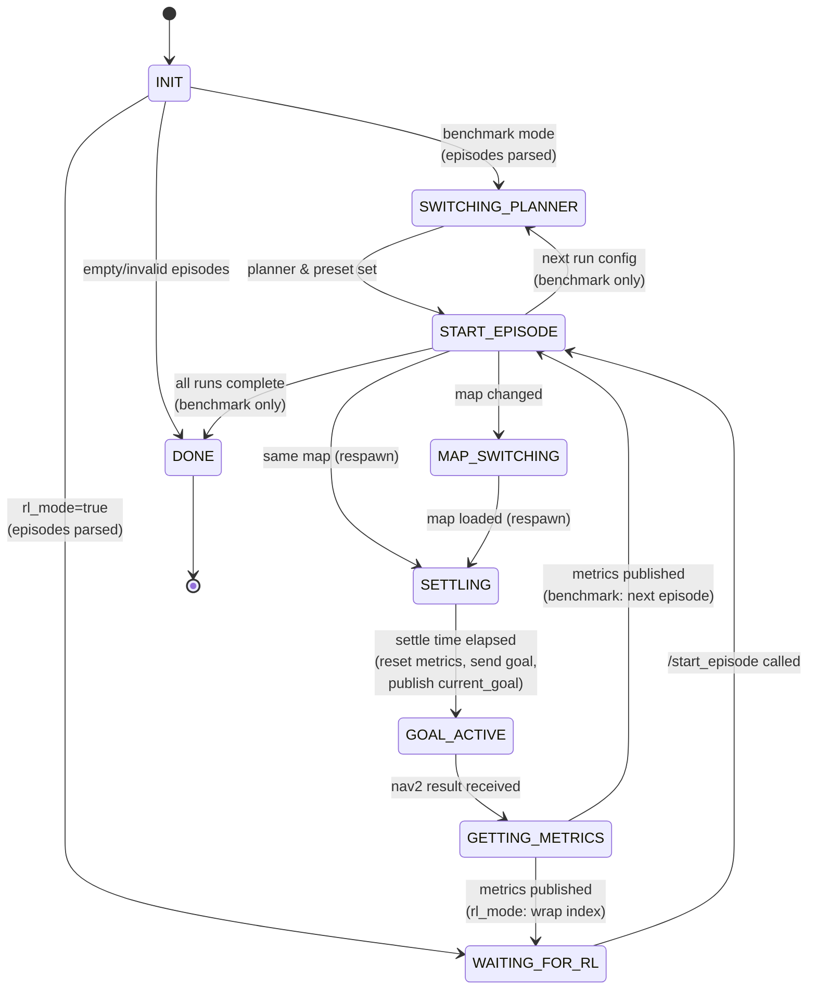

# Episode Runner State Machine



## State Descriptions

| State | Description |
|-------|-------------|
| **INIT** | Parse episodes JSON from parameter; branch on `rl_mode` |
| **SWITCHING_PLANNER** | Switch to current run's planner (DWB/MPPI) and preset (1/2) — benchmark mode only |
| **WAITING_FOR_RL** | Idle; waiting for RL env to call `/potr_navigation/start_episode` |
| **START_EPISODE** | Check if more episodes; handle map change or respawn |
| **MAP_SWITCHING** | Load new map via `/map_server/load_map` service |
| **SETTLING** | Wait `SETTLE_SECS` (2s) after respawn before sending goal |
| **GOAL_ACTIVE** | Nav2 goal is active; waiting for result |
| **GETTING_METRICS** | Fetch metrics from tracker, publish `EpisodeMetrics` |
| **DONE** | All runs and episodes complete (benchmark mode only) |

## Modes

### Benchmark mode (`rl_mode=false`, default)

The outer loop iterates through `RUN_CONFIGS`:

```
(DWB, 1) → (DWB, 2) → (MPPI, 1) → (MPPI, 2)
```

For each config, all episodes are executed before moving to the next config.

### RL mode (`rl_mode=true`)

`RUN_CONFIGS` is not used. The RL env controls planner/preset via the
`/potr_navigation/switch_planner`, `/potr_navigation/set_param_preset`, and
`/potr_navigation/set_raw_params` services.

After each episode completes, `episode_runner` returns to `WAITING_FOR_RL` and
wraps the episode index so training can run indefinitely. The RL env calls
`/potr_navigation/start_episode` (std_srvs/Trigger) at the start of each
`env.reset()` to trigger the next episode.

### Published topics (both modes)

| Topic | Type | When |
|-------|------|------|
| `/potr_navigation/current_goal` | `geometry_msgs/Pose` | On each new goal send |
| `/potr_navigation/episode_metrics` | `EpisodeMetrics` | End of each episode |
| `/potr_navigation/step_metrics` | `StepMetrics` | Every odom tick (metrics_tracker) |
