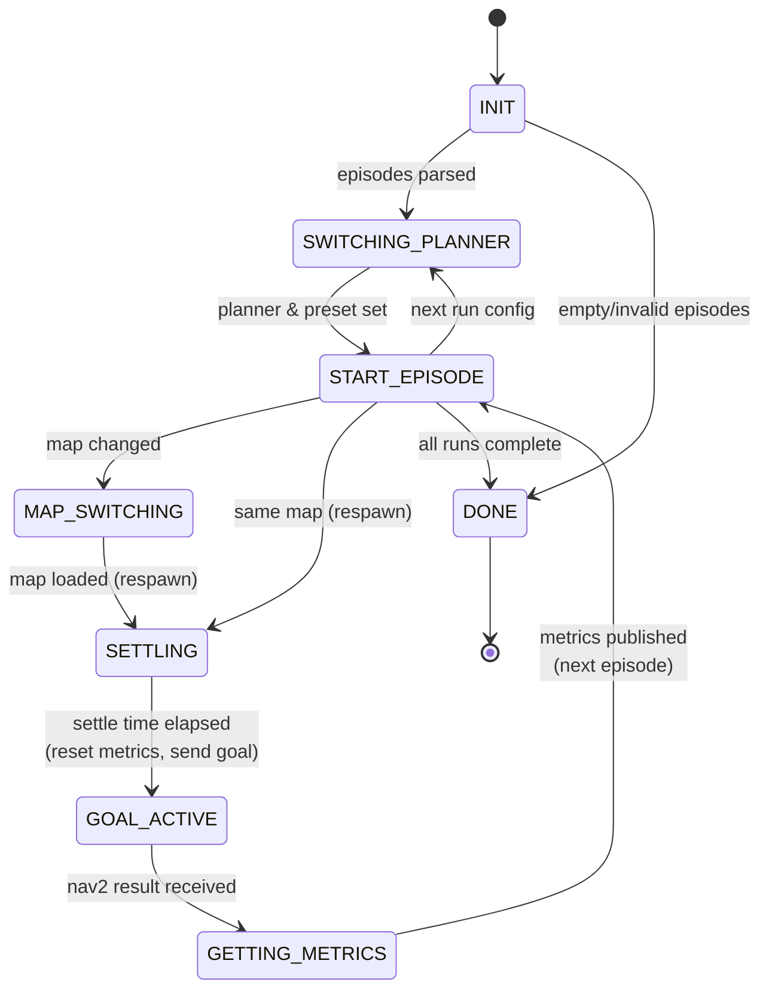

# Episode Runner State Machine



## State Descriptions

| State | Description |
|-------|-------------|
| **INIT** | Parse episodes JSON from parameter |
| **SWITCHING_PLANNER** | Switch to current run's planner (DWB/MPPI) and preset (1/2) |
| **START_EPISODE** | Check if more episodes; handle map change or respawn |
| **MAP_SWITCHING** | Load new map via `/map_server/load_map` service |
| **SETTLING** | Wait `SETTLE_SECS` (2s) after respawn before sending goal |
| **GOAL_ACTIVE** | Nav2 goal is active; waiting for result |
| **GETTING_METRICS** | Fetch metrics from tracker, publish `EpisodeMetrics` |
| **DONE** | All runs and episodes complete |

## Run Configs Loop

The outer loop iterates through `RUN_CONFIGS`:

```
(DWB, 1) → (DWB, 2) → (MPPI, 1) → (MPPI, 2)
```

For each config, all episodes are executed before moving to the next config.
