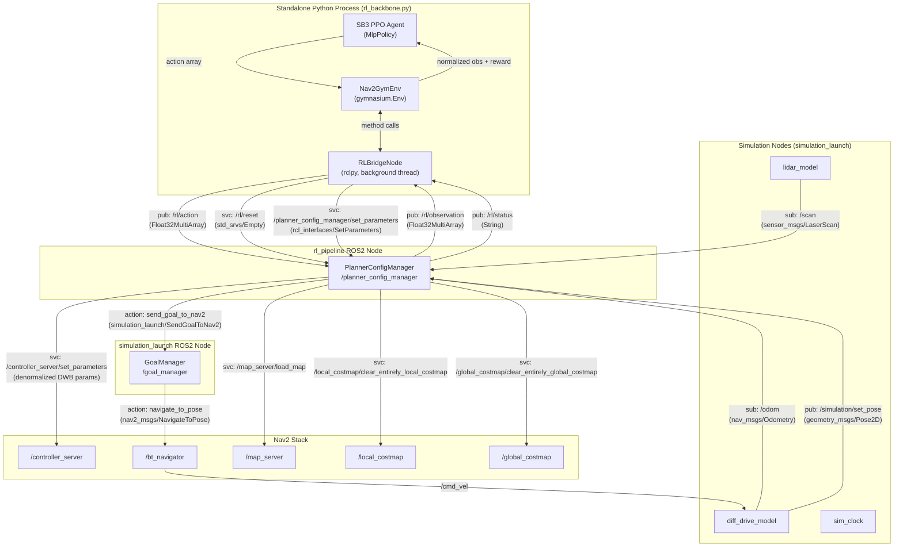
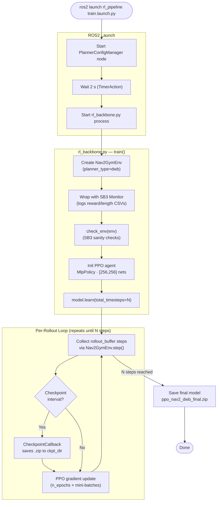
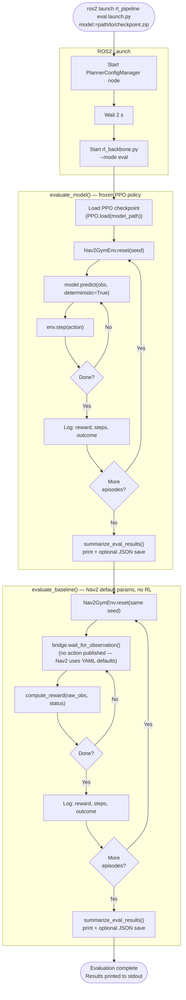

# rl_pipeline — Architecture & Flow Documentation

> **Project:** POT-r (Parameter-Optimizing Tuner via RL)  
> **Stack:** ROS2 Jazzy · Nav2 · Stable-Baselines3 PPO · Gymnasium  
> **Packages:** `rl_pipeline` · `simulation_launch`

---

## Table of Contents
1. [System Architecture](#1-system-architecture)
2. [Node & Interface Reference](#2-node--interface-reference)
3. [Training Mode Flow](#3-training-mode-flow)
4. [Episode Lifecycle](#4-episode-lifecycle)
5. [Observation & Action Pipeline](#5-observation--action-pipeline)
6. [Evaluation Mode Flow](#6-evaluation-mode-flow)
7. [Launch File Reference](#7-launch-file-reference)
8. [Known Issues & TODOs](#8-known-issues--todos)

---

## 1. System Architecture

The pipeline has two distinct execution contexts that communicate over ROS2 topics and services:

- **Standalone Python process** — `rl_backbone.py` owns the SB3 training loop and spins a lightweight `RLBridgeNode` in a background thread to interface with ROS2.
- **ROS2 nodes** — `planner_config_manager` (rl_pipeline) and `goal_manager` (simulation_launch) integrate with Nav2.



---

## 2. Node & Interface Reference

### `PlannerConfigManager`  (`rl_pipeline/scripts/planner_config_manager.py`)

| Interface | Type | Direction | Purpose |
|---|---|---|---|
| `/scan` | `sensor_msgs/LaserScan` | **sub** | Builds downsampled (range, bearing) LiDAR feature vector |
| `/odom` | `nav_msgs/Odometry` | **sub** | Extracts `vx`, `wz` for state vector |
| `/rl/action` | `std_msgs/Float32MultiArray` | **sub** | Receives normalized PPO action `[-1,1]^6`, denormalizes, forwards to Nav2 |
| `/rl/observation` | `std_msgs/Float32MultiArray` | **pub** | Publishes raw state vector at 20 Hz |
| `/rl/status` | `std_msgs/String` | **pub** | Publishes episode status: `idle` / `running` / `goal_reached` / `collision` / `timeout` |
| `/simulation/set_pose` | `geometry_msgs/Pose2D` | **pub** | Snaps diff_drive_model to episode start pose |
| `/rl/reset` | `std_srvs/Empty` | **svc server** | Triggers episode reset (map load, pose snap, costmap clear, new Nav2 goal) |
| `/planner_config_manager/set_parameters` | `rcl_interfaces/SetParameters` | **svc server** (auto) | Receives episode config from `RLBridgeNode.call_reset()` |
| `/controller_server/set_parameters` | `rcl_interfaces/SetParameters` | **svc client** | Applies denormalized DWB params every step |
| `/map_server/load_map` | `nav2_msgs/LoadMap` | **svc client** | Hot-swaps map at episode start |
| `/local_costmap/clear_entirely_local_costmap` | `nav2_msgs/ClearEntireCostmap` | **svc client** | Clears stale costmap data |
| `/global_costmap/clear_entirely_global_costmap` | `nav2_msgs/ClearEntireCostmap` | **svc client** | Clears stale costmap data |
| `send_goal_to_nav2` | `simulation_launch/SendGoalToNav2` | **action client** | Dispatches goal to `GoalManager` |

**Key ROS2 parameters (configurable at launch):**

| Parameter | Default | Description |
|---|---|---|
| `planner_type` | `'dwb'` | Which planner's param bounds to use |
| `max_episode_steps` | `500` | Step limit before truncation |
| `collision_threshold` | `0.10 m` | Min LiDAR range triggering collision |
| `lidar_downsample_n` | `18` | Number of (range, bearing) pairs in state |
| `xy_tolerance` | `0.25 m` | Goal proximity threshold |
| `yaw_tolerance` | `0.40 rad` | Goal heading threshold |

---

### `GoalManager`  (`simulation_launch/scripts/goal_manager.py`)

| Interface | Type | Direction | Purpose |
|---|---|---|---|
| `navigate_to_pose` | `nav2_msgs/NavigateToPose` | **action client** | Forwards goal to Nav2 BT Navigator |
| `send_goal_to_nav2` | `simulation_launch/SendGoalToNav2` | **action server** | Accepts goals from `PlannerConfigManager` |
| `/bt_navigator/get_state` | `lifecycle_msgs/GetState` | **svc client** | Polls Nav2 lifecycle state before transmitting goals |

---

### `RLBridgeNode`  (class inside `rl_backbone.py`, runs in background thread)

| Interface | Type | Direction | Purpose |
|---|---|---|---|
| `/rl/observation` | `std_msgs/Float32MultiArray` | **sub** | Buffers latest raw observation; unblocks `wait_for_observation()` |
| `/rl/status` | `std_msgs/String` | **sub** | Caches latest episode status string |
| `/rl/action` | `std_msgs/Float32MultiArray` | **pub** | Publishes raw PPO action each step |
| `/rl/reset` | `std_srvs/Empty` | **svc client** | Triggers episode reset on `PlannerConfigManager` |
| `/planner_config_manager/set_parameters` | `rcl_interfaces/SetParameters` | **svc client** | Pushes episode config before calling `/rl/reset` |

---

## 3. Training Mode Flow



---

## 4. Episode Lifecycle

This diagram covers what happens inside a single Gymnasium `reset()` → `step()` → terminal cycle, which corresponds to one navigation attempt by the TurtleBot.

```mermaid
flowchart TD
    A([Nav2GymEnv.reset()]) --> B
    B["Sample random\n(map, start_pose, goal_pose)\nfrom EPISODE_MAP_CONFIGS"] --> C
    C["RLBridgeNode.call_reset(config):\n  1. SetParameters on PlannerConfigManager\n     (goal_id, start_x/y/yaw, goal_x/y/yaw,\n      xy_tolerance, map_filepath)\n  2. Call /rl/reset service"] --> D

    subgraph "PlannerConfigManager.reset_config()"
        D["load_map(map_filepath)\n↳ /map_server/load_map"] --> E
        E["reset_diff_drive(start_x, start_y, start_yaw)\n↳ pub /simulation/set_pose"] --> F
        F["clear_costmaps()\n↳ local + global costmap clear"] --> G
        G["send_nav2_goal(goal_x, goal_y, goal_yaw)\n↳ send_goal_to_nav2 action client"] --> H
        H["episode_status = 'running'\nepisode_step = 0"]
    end

    H --> I["wait_for_observation(timeout=10 s)\n(first obs from new episode)"]
    I --> J(["return obs, info"])

    J --> K

    subgraph "Step Loop  (repeats each PPO timestep)"
        K(["Nav2GymEnv.step(action)"]) --> L
        L["bridge.apply_action(action)\n↳ pub /rl/action"] --> M

        subgraph "PlannerConfigManager.process_action()"
            M["Denormalize: [-1,1] → [0,1] → [lo, hi]\nper DWB_PARAM_BOUNDS"] --> N
            N["/controller_server/set_parameters\n(max_vel_x, min_speed_xy,\nGoalAlign.scale, PathAlign.scale,\nGoalDist.scale, PathDist.scale)"]
        end

        N --> O["bridge.wait_for_observation(timeout=2 s)"]

        subgraph "PlannerConfigManager.publish_observation()  (20 Hz timer)"
            O --> P["build_observation()\n[lidar×18 (range,bearing), Δx, Δy, Δyaw, vx, wz]"]
            P --> Q["check_terminal()\n↳ collision? goal_reached? timeout?"]
            Q --> R["pub /rl/observation\npub /rl/status"]
        end

        R --> S["compute_reward(raw_obs, status)"]
        S --> T{Terminal?}
        T -->|goal_reached / collision| U["terminated = True"]
        T -->|timeout| V["truncated = True"]
        T -->|running| K
    end

    U --> W(["return obs, reward, terminated, truncated, info"])
    V --> W
```

---

## 5. Observation & Action Pipeline

### State Vector Layout  (dim = 41)

```
Index  0          : LiDAR range   — sector 0  (closest return in 0°–20° arc)
Index  1          : LiDAR bearing — sector 0
Index  2          : LiDAR range   — sector 1  (closest return in 20°–40° arc)
Index  3          : LiDAR bearing — sector 1
       ...
Index  34         : LiDAR range   — sector 17
Index  35         : LiDAR bearing — sector 17
Index  36         : Δx  to goal   (robot frame)
Index  37         : Δy  to goal   (robot frame)
Index  38         : Δyaw to goal  (wrapped to [-π, π])
Index  39         : vx  forward velocity
Index  40         : wz  steering velocity
```

### Normalization for PPO Input

| Component | Raw range | Normalized range |
|---|---|---|
| LiDAR ranges | `[0, range_max]` | `[0, 1]` (clipped) |
| LiDAR bearings | `[0, 2π]` | `[0, 1]` |
| Δx, Δy to goal | `[-15 m, 15 m]` | `[-1, 1]` |
| Δyaw to goal | `[-π, π]` | `[-1, 1]` |
| Forward velocity vx | `[-0.5, 0.5 m/s]` | `[-1, 1]` |
| Steering velocity wz | `[-1.0, 1.0 rad/s]` | `[-1, 1]` |

### Action Vector Layout  (dim = 6)  — DWB planner

PPO outputs actions through a `tanh` layer, so all values are in `[-1, 1]`.  
`PlannerConfigManager.process_action()` maps them back to physical units:

| Index | Parameter | Min | Max |
|---|---|---|---|
| 0 | `FollowPath.max_vel_x` | 0.05 m/s | 0.50 m/s |
| 1 | `FollowPath.min_speed_xy` | 0.00 m/s | 0.20 m/s |
| 2 | `FollowPath.GoalAlign.scale` | 1.0 | 50.0 |
| 3 | `FollowPath.PathAlign.scale` | 1.0 | 50.0 |
| 4 | `FollowPath.GoalDist.scale` | 1.0 | 50.0 |
| 5 | `FollowPath.PathDist.scale` | 1.0 | 50.0 |

Denormalization formula:  `real_val = clip(norm_val, 0, 1) × (hi − lo) + lo`  
where `norm_val = (ppo_output + 1) / 2`

### Reward Function

```
R_total = R_terminal  +  R_step_penalty  +  R_progress  +  R_smooth  +  R_proximity

  R_terminal     = +100   if goal_reached
                 = -100   if collision

  R_step_penalty = -0.01  (every non-terminal step)

  R_progress     = +10 × (prev_dist_to_goal − curr_dist_to_goal)
                   (positive when closing on goal)

  R_smooth       = -0.01 × |wz|
                   (penalizes unnecessary rotation)

  R_proximity    = -1.0 × max(0, 1 − min_lidar_range)
                   (active only when min range < 1.0 m)
```

---

## 6. Evaluation Mode Flow

Running `eval.launch.py` executes two sequential back-to-back evaluations over identical episode sequences (controlled by `--eval-seed`) for a fair comparison.



---

## 7. Launch File Reference

### `train.launch.py`

| Argument | Default | Description |
|---|---|---|
| `planner` | `dwb` | Local planner to tune (`dwb` \| `mppi`) |
| `max_episode_steps` | `500` | Step limit before episode truncation |
| `steps` | `500000` | Total PPO training steps |
| `log_dir` | `~/rl_logs` | TensorBoard logs + Monitor CSVs |
| `ckpt_dir` | `~/rl_checkpoints` | Model checkpoint output directory |
| `net_arch` | `[256, 256]` | JSON list of hidden layer widths |
| `lr` | `3e-4` | PPO learning rate |
| `ro_buffer` | `2048` | Rollout buffer size (n_steps) |
| `batch_size` | `64` | PPO mini-batch size |
| `epochs` | `10` | PPO optimization epochs per rollout |

```bash
# Minimal
ros2 launch rl_pipeline train.launch.py

# Custom hyper-params
ros2 launch rl_pipeline train.launch.py \
    steps:=1000000 lr:=1e-4 net_arch:='[512,512]' \
    log_dir:=/data/rl_logs ckpt_dir:=/data/rl_ckpts
```

### `eval.launch.py`

| Argument | Default | Description |
|---|---|---|
| `planner` | `dwb` | Planner the model was trained on |
| `max_episode_steps` | `500` | Should match value used during training |
| `model` | *(empty — **required**)* | Path to `.zip` PPO checkpoint |
| `episodes` | `10` | Episodes per evaluation run |
| `eval_seed` | `28` | RNG seed (keep same as training eval for fair comparison) |
| `results` | *(empty)* | Optional `.json` output path *(requires parser fix — see §8)* |

```bash
# Minimal (required arg)
ros2 launch rl_pipeline eval.launch.py \
    model:=~/rl_checkpoints/ppo_nav2_dwb_final.zip

# Full options
ros2 launch rl_pipeline eval.launch.py \
    model:=~/rl_checkpoints/ppo_nav2_dwb_500k.zip \
    episodes:=50 eval_seed:=42
```

---

## 8. Known Issues & TODOs

### Bug — `args.results` AttributeError in `rl_backbone.py`

`evaluate_model()` and `evaluate_baseline()` are called with `results_path=args.results` in the `__main__` block, but `--results` is never declared in `build_parser()`.  This will raise `AttributeError: Namespace object has no attribute 'results'` the first time eval mode is run.

**Fix** — add one line to `build_parser()`:
```python
p.add_argument(
    '--results', type=str, default=None,
    help='Path to JSON file for saving evaluation results'
)
```

### Bug — `NameError` in `PlannerConfigManager.process_action()`

Line 116 references `normalized_values` before it is assigned (it is assigned on line 123).  The error message should reference `normalized_params` instead:

```python
# Line 116 — change:
f"Action dimension mismatch: received {len(normalized_values)}, "
# to:
f"Action dimension mismatch: received {len(normalized_params)}, "
```

### Bug — `pack_eval_results()` uses undefined `path` and `summary` variables

In `rl_backbone.py`, `pack_eval_results()` references `path` and `summary` where `filepath` and `results` were intended:

```python
# Change:
if os.path.exists(path):
    with open(path, 'r') as f: ...
existing[key] = summary
with open(path, 'w') as f: ...
# To:
if os.path.exists(filepath):
    with open(filepath, 'r') as f: ...
existing[key] = results
with open(filepath, 'w') as f: ...
```

### TODO — Map start/goal coordinates are placeholders

All entries in `MAP_CONFIGS` inside `pipeline_utils.py` use identical placeholder `(start_x=0, start_y=0, goal_x=N, goal_y=N)` coordinates.  These must be replaced with valid poses for each map before training begins, otherwise every episode will start in the same corner regardless of the map loaded.

### TODO — MPPI action space is undefined

`PLANNER_PARAM_BOUNDS` only has an entry for `dwb`.  The `mppi` key is listed as a placeholder.  Exposing MPPI parameters and updating `NUM_ACTIONS` will be required before `--planner mppi` can be used.

### TODO — `lidar_model` scan segmentation off-by-one

In `process_scan()`, the segment slice `raw_scan[(i-1):i]` produces a single-element array for all values of `i`, meaning the min-range feature selection within each sector degenerates to a plain index selection.  The correct slice should be:
```python
segment_size = len(raw_scan) // n_samples
raw_scan[(i-1)*segment_size : i*segment_size]
```
