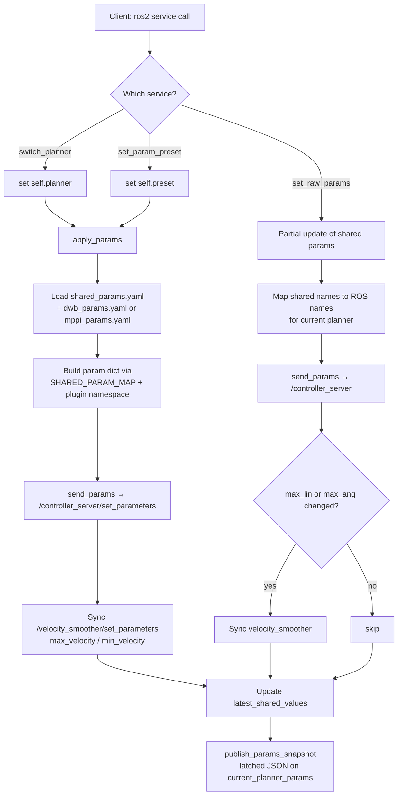
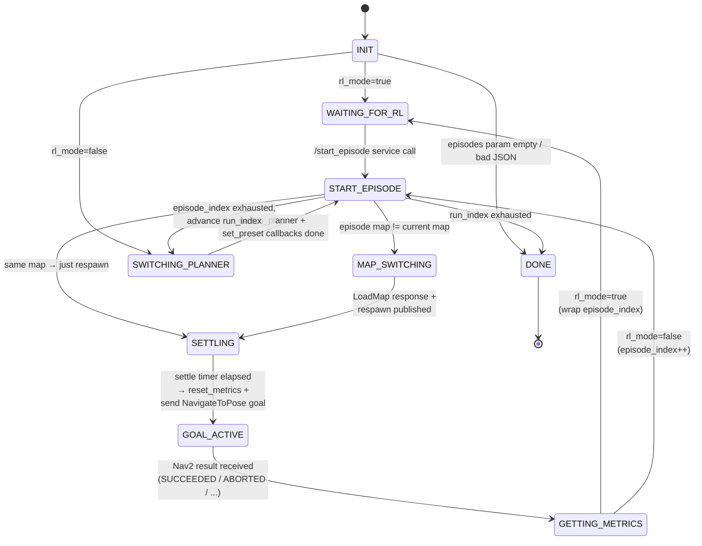
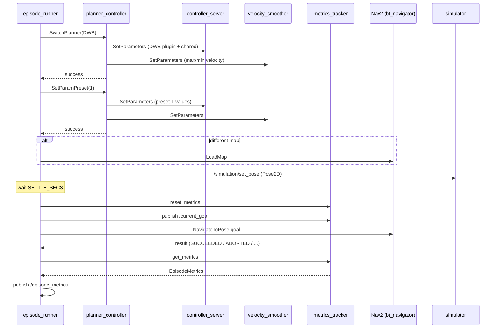

# Planner Controller & Episode Runner

Two ROS2 nodes that collaborate to benchmark Nav2 controllers:

- **`planner_controller.py`** — swaps between DWB and MPPI controllers at runtime and pushes parameter updates to `/controller_server` and `/velocity_smoother`.
- **`episode_runner.py`** — drives a state machine that loops over `(planner, preset) × episode` combinations, respawns the robot, sends Nav2 goals, and collects metrics.

---

## 1. `planner_controller.py`

### Purpose
A thin control-plane node. It does **not** plan anything itself; it just holds the currently-active `(planner, preset)` pair and translates high-level requests into ROS parameter updates on the running `controller_server` + `velocity_smoother`.

### Services exposed
| Service | Type | Behavior |
|---|---|---|
| `/potr_navigation/switch_planner` | `SwitchPlanner` | Sets `self.planner` (DWB / MPPI) and reapplies current preset. |
| `/potr_navigation/set_param_preset` | `SetParamPreset` | Sets `self.preset` (1 / 2) and reapplies full parameter set. |
| `/potr_navigation/set_raw_params` | `SetRawParams` | Writes a partial set of shared-name params (e.g. `max_linear_vel`) directly. Used by the RL policy. |

### Published topic
- `/potr_navigation/current_planner_params` — latched `std_msgs/String` JSON blob `{planner, preset, values}`. Late subscribers still see the current state.

### Parameter mapping
`SHARED_PARAM_MAP` maps shared logical names (`max_linear_vel`, `goal_align_scale`, …) to per-planner ROS names (`FollowPathDWB.max_vel_x` for DWB vs `FollowPath.vx_max` for MPPI). This lets the RL agent speak one vocabulary regardless of which controller is loaded.

### Apply flow
`apply_params()` reloads the YAMLs and pushes **both** the shared params and the planner-specific plugin block to `controller_server`, then syncs `max_velocity`/`min_velocity` on `velocity_smoother` so acceleration limits don't clip the new speed envelope. The `critics` key is skipped — updating it live crashes the controller.

### Diagram

---

## 2. `episode_runner.py`

### Purpose
Runs benchmark episodes end-to-end. For each `(planner, preset)` in `RUN_CONFIGS` and each episode loaded from the `episodes` parameter (a JSON list of `{map, start, goal}`), it:

1. Tells `planner_controller` to switch planner + preset.
2. Switches the map if the episode uses a different one.
3. Teleports the robot to `start` via `/simulation/set_pose` (map→odom converted).
4. Waits `SETTLE_SECS` for physics to settle.
5. Resets metrics, publishes the goal pose, sends a `NavigateToPose` action goal.
6. Waits for Nav2 to finish, fetches metrics, publishes `EpisodeMetrics`.

Two operating modes, selected by the `rl_mode` parameter:

- **Benchmark mode** (`rl_mode=False`): loops through all configs × episodes autonomously.
- **RL mode** (`rl_mode=True`): idles in `S_WAITING_FOR_RL` until an external caller hits `/potr_navigation/start_episode`. Episode index wraps so training can run indefinitely.

### Secondary role: manual goal action server
Independent of the run loop, the node also hosts an `SendGoalToNav2` action server. `manage_send_goal` forwards the request to Nav2 while `monitor_goal` (10 Hz) watches TF for position/yaw error and declares success when tolerances are hit (bypassing Nav2's own goal-reached criterion if needed).

### Pose jittering
When `randomize_poses=True`, `jittered_episode()` adds uniform ±`jitter_xy` and ±`jitter_yaw` noise to both start and goal for domain randomization. Default is off because several hand-tuned goalpoints sit close to obstacles.

### Diagram

### Run-loop timing
Three timers keep the node alive:

| Timer | Period | Role |
|---|---|---|
| `check_nav2_active` | 0.1 s | Polls `/bt_navigator/get_state`; gates the run loop on Nav2 being `active`. |
| `run_loop_tick` | 0.5 s | Advances the state machine above. |
| `monitor_goal` | 0.1 s | Drives the `SendGoalToNav2` action server (TF-based error feedback). |

### Key external dependencies
- **`planner_controller`**: `/potr_navigation/switch_planner`, `/potr_navigation/set_param_preset`.
- **`metrics_tracker`**: `/potr_navigation/reset_metrics`, `/potr_navigation/get_metrics`, and subscribes to `/potr_navigation/current_goal` for distance/heading error.
- **Nav2**: `navigate_to_pose` action, `/map_server/load_map`, `/bt_navigator/get_state`.
- **Simulator**: `/simulation/set_pose` (Pose2D in odom frame — note the `map_to_odom_x/y` offset).

---

## How they fit together

