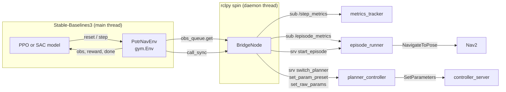
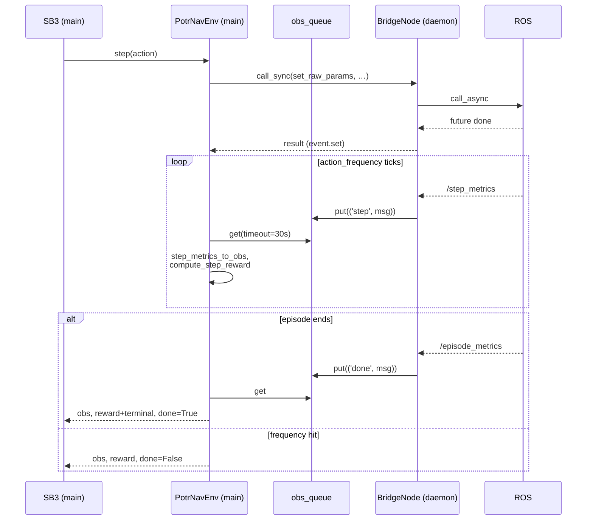
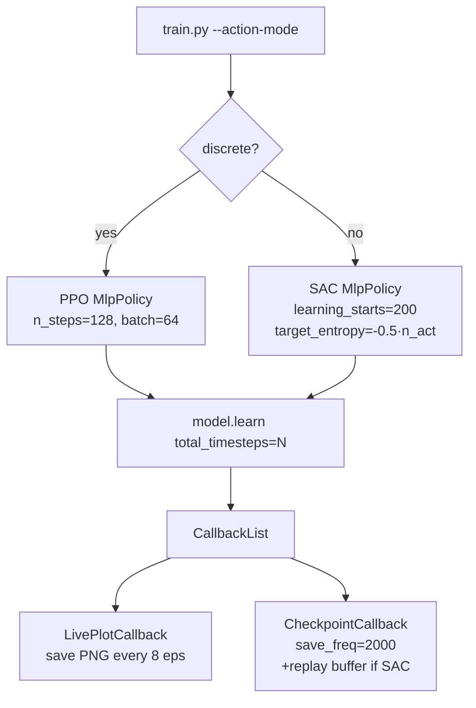
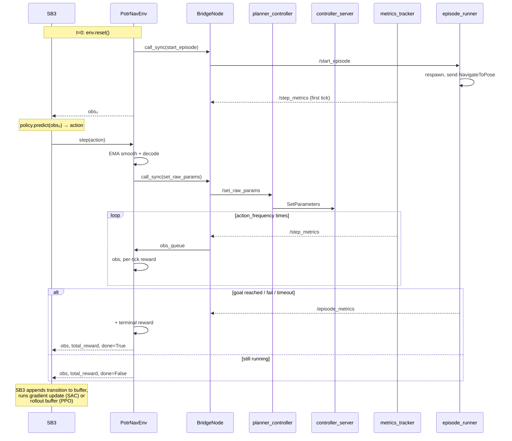

# RL Training Pipeline — Stable-Baselines3 over ROS2

This document explains how the `potr_rl` package bridges Stable-Baselines3 (SB3) to the live ROS2 / Nav2 simulation so that a policy can **tune planner parameters online** while the robot drives around.

The pieces:

| File | Role |
|---|---|
| `train.py` | Entry point — builds the env, picks PPO/SAC, runs `model.learn`. |
| `potr_rl/env.py` | `PotrNavEnv` (Gymnasium) + `BridgeNode` (rclpy). The glue. |
| `potr_rl/params.py` | Action/obs space definitions, param ranges, reward weights. |
| `potr_rl/callbacks.py` | `LivePlotCallback` — renders training curves to PNG. |

The env talks to `episode_runner` and `planner_controller` (see `potr_navigation/scripts/PLANNER_AND_EPISODE_RUNNER.md`) over normal ROS topics/services; there is no direct Python coupling between the policy and Nav2.

---

## 1. High-level architecture



The critical design choice: **SB3 is synchronous, ROS is asynchronous.** The gym `step()` call must return `(obs, reward, done, trunc, info)` eventually, but Nav2 and the metrics_tracker produce data on their own schedule. The bridge flattens this into a blocking `queue.get()` loop.

---

## 2. Threading model

`PotrNavEnv.__init__` does:

1. `rclpy.init()`
2. Creates `BridgeNode` (subscriptions + service clients).
3. Creates a `MultiThreadedExecutor`, adds the node, and spins it in a **daemon thread**.
4. Subscriptions push messages into `self.obs_queue` (a `queue.Queue` — thread-safe).

SB3 runs on the **main thread**. When SB3 calls `env.step(action)`:

- `apply_action` publishes service calls via `call_sync` — it posts `call_async` from the main thread, then `event.wait()`s until the rclpy thread fires the done-callback.
- The main thread then drains the queue with `obs_queue.get(timeout=...)` until enough `StepMetrics` messages arrive (controlled by `action_frequency`) or an `EpisodeMetrics` message terminates the episode.



---

## 3. The gym contract — what's in an "episode"

An SB3 "episode" maps to exactly one `episode_runner` episode (one start pose, one goal pose):

| Gym event | ROS effect |
|---|---|
| `env.reset()` | Calls `/potr_navigation/start_episode`. `episode_runner` is idling in `S_WAITING_FOR_RL`; the call pushes it into `S_START_EPISODE`, which respawns the robot, resets metrics, and sends the Nav2 goal. The env then blocks on `obs_queue` until the first `StepMetrics` arrives. |
| `env.step(action)` | Applies the action (below), then consumes `action_frequency` `StepMetrics` messages — each ~0.1 s of sim time. So `action_freq=10` ≈ 1 s per gym step; `action_freq=50` ≈ 5 s per gym step. MPPI needs ≥50 because frequent param rewrites cause reset storms. |
| Episode end | When `/episode_metrics` arrives, the env adds the terminal reward (`goal_bonus` / `fail_penalty`) and returns `done=True`. Next `reset()` triggers the next episode. |

The `rl_mode=True` parameter on `episode_runner` is what makes this work — it wraps the episode index forever so training can run indefinitely.

---

## 4. Action spaces

Two flavours, selected by `--action-mode`:

### Discrete (PPO)
`spaces.Discrete(4)` — an integer indexes into `DISCRETE_CONFIGS`:
```python
[('DWB', 1), ('DWB', 2), ('MPPI', 1), ('MPPI', 2)]
```
`apply_action` calls `switch_planner` + `set_param_preset`. Coarse — the policy picks one of four hand-tuned configs per decision window.

### Continuous (SAC)
`spaces.Box(low=-1, high=1, shape=(n_act,))` — one dimension per tunable param in `PLANNER_PARAM_RANGES[planner]` (4 for MPPI, 9 for DWB).

Three things happen to the raw action before it hits the controller:

1. **EMA smoothing** (`ACTION_EMA_ALPHA = 0.3`): `smoothed = 0.3·prev + 0.7·new`. Raw policy output is jittery; unfiltered rewrites trigger MPPI reset storms. The policy still sees raw actions for credit-assignment, but Nav2 sees smoothed.
2. **Decode** via `decode_param`:
   - Linear default: `val = lo + (a+1)/2 · (hi-lo)`. Action `0` → midpoint.
   - Log for `obstacle_scale` only (spans 0.005–0.1 — two orders of magnitude). `val = lo · (hi/lo)^((a+1)/2)`. Each unit of action corresponds to a fixed **cost ratio**, not absolute delta.
3. **Send** as `SetRawParams(names, values)` to `planner_controller`, which maps shared names → per-planner ROS names and pushes to `/controller_server/set_parameters`.

`encode_param` is the inverse — `eval.py` uses it to build a baseline action vector that decodes exactly to preset 1's values, so the policy's "do nothing" reference is the hand-tuned preset.

---

## 5. Observation space

8 base dims + the smoothed action suffix (4 or 9 dims). Raw components:

| Index | Source | Meaning |
|---|---|---|
| 0–2 | `StepMetrics.path_cost_{near,mid,far}` | Max Nav2 costmap value sampled in three arc-length windows along the global plan. 254 = lethal, 0 = free. |
| 3 | `distance_to_goal` | metres |
| 4 | `heading_error_to_goal` | radians |
| 5 | `linear_velocity` | m/s |
| 6 | `angular_velocity` | rad/s |
| 7 | `path_deviation` | m, lateral distance from global plan |
| 8+ | `self.smoothed_action` | The action the controller is *actually* running (not the raw policy output) |

`step_metrics_to_obs` clips base values to `[OBS_LOW, OBS_HIGH]` and normalises to `[-1, 1]`. The smoothed-action suffix is already in `[-1, 1]` by construction.

Appending the smoothed action to the obs is the only way a continuous policy can observe its own state — otherwise it would be trying to predict deltas blind. Lidar was dropped deliberately: the policy's job is path-centric ("is my plan blocked?"), which `path_cost_*` answers directly.

---

## 6. Reward

Per-tick terms (accumulate ~1200× per episode at `action_freq=10`):

| Term | Weight | Signal |
|---|---|---|
| `progress` | +1.0 × Δ-distance | Rewards getting closer to goal since last tick. |
| `path_dev` | −0.02 × path_deviation | Small guardrail against swerving off-plan. |
| `ang_vel` | −0.01 × \|ω\| | Small guardrail against spinning. |
| `proximity` | −0.1 × max(0, path_cost_near−30)/100 | Graduated penalty for entering the inflation halo. Replaces binary collision penalty so the gradient is continuous. |
| `time_step` | −0.2 per tick | **Dominant** per-episode term — rewards faster completions. |

Terminal (once per episode, from `/episode_metrics`):

| Term | Weight |
|---|---|
| `goal_bonus` | +100.0 |
| `fail_penalty` | −50.0 |

The per-tick weights are shaped so episode **duration** (which the policy can influence via max_vel/accel) dominates the variable part of the signal — i.e., tuning for speed is rewarded.

---

## 7. Algorithm choice



**PPO** for discrete because the action space is tiny and on-policy works fine.

**SAC** for continuous because it's off-policy (sample-efficient — each ~1s gym step is expensive in wall-clock), and its entropy bonus keeps exploration alive. `target_entropy=-0.5·n_act` was tightened from SB3's default `-n_act`; the default kept exploration alive long enough to *find* a good tune but prevented the policy from *committing* to one.

---

## 8. Checkpointing and resume

`CheckpointCallback(save_freq=2000, save_replay_buffer=True)` writes every 2000 env steps. The callback name-prefixes files like `{run_name}_ckpt_{N}_steps.zip` and (for SAC) `_ckpt_replay_buffer_{N}_steps.pkl`.

Resume flow for SAC (`--resume path/to/ckpt.zip`):

1. `SAC.load(resume, env=env)` — restores weights, optimiser, **`num_timesteps`**.
2. If `{stem}.replay.pkl` exists, `load_replay_buffer` rehydrates it.
3. If it doesn't, the buffer is empty but `num_timesteps` is already past `learning_starts=200` — so updates would begin on a near-empty buffer and **degrade the loaded policy**. The workaround in `train.py`:
   ```python
   warmup = 500
   model.learning_starts = model.num_timesteps + warmup
   ```
   Push `learning_starts` forward to rebuild a usable buffer before updates resume.
4. `model.learn(..., reset_num_timesteps=False)` — critical. Default `True` would zero the counter, pushing our warmup offset far out of reach and producing a run with **zero gradient updates**.

---

## 9. LivePlotCallback

Headless PNG rendering (`matplotlib.use('Agg')`) — works inside Docker without a display. Re-saves the plot every `update_every` episodes and once at training end. Open the file in any image viewer and refresh to monitor.

What it tracks per episode (from `info` dict, populated by `PotrNavEnv.episode_info`):

- Reward and episode length (raw + 10-ep rolling mean).
- Termination breakdown — rolling fraction of `goal` / `fail` / `truncated`.
- Reward component breakdown — `progress`, `path_dev`, `ang_vel`, `proximity`, `time`, `terminal`.
- Collision fraction and final distance to goal (twin y-axis).
- `ent_coef` for SAC (auto-tuned entropy coefficient).
- Param switch count and mean EMA delta per episode.

---

## 10. End-to-end: one training step



---

## 11. Gotchas worth knowing

- **Initial planner switch is mandatory.** `PotrNavEnv.__init__` sends `SwitchPlanner(self.planner)` before anything else. Without it, `planner_controller` defaults to MPPI and DWB-only param names (e.g. `goal_align_scale`) silently fail their name lookup. The policy would then have zero effect on the controller — an invisible failure mode that looks like "agent doesn't learn."
- **`call_service` wraps `call_sync`** to surface service failures as log warnings. Previously we ignored the response, which hid the above.
- **`action_frequency` trades decisions for stability.** At 10 (1s per step) the policy gets many decisions but MPPI reset storms dominate. At 50 (5s per step) MPPI is stable but episodes give fewer learning signals. The `--action-freq` flag is the knob.
- **EMA `ACTION_EMA_ALPHA=0.3` leaks 70% of new action instantly.** Too much smoothing (e.g. 0.7) buries the credit-assignment signal; too little (0.0) triggers reset storms. 0.3 is the empirical sweet spot.
- **`check_env` is opt-in** (`--check`). Useful after editing obs/action spaces; skips otherwise because each "step" costs a second of wall-clock.
